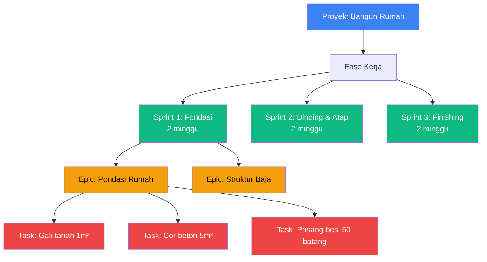
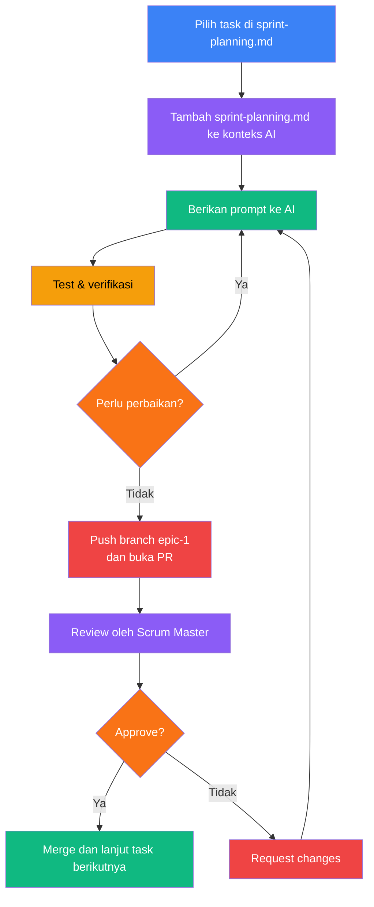

<div align="center">

</div>

# Backend Studio – Ringkasan & Workflow Tim

Backend Studio adalah single-page application untuk mensimulasikan REST API backend secara lokal. Aplikasi ini memudahkan pengembangan dan pengujian client-side dengan mock engine, service worker untuk intercept request, dan tools di dalam UI untuk men-simulate request dan response.

## Menjalankan Project (singkat)

Persyaratan singkat: Node.js (LTS) dan npm. Untuk menjalankan: jalankan `npm install` lalu `npm run dev`, kemudian buka alamat yang tampil di terminal (biasanya `http://localhost:5173`).

Catatan penyimpanan: aplikasi sekarang mendukung **IndexedDB** sebagai backend persistence yang lebih andal. Startup akan memanggil `dbService.init({ backend: 'auto' })` (di `index.tsx`) dan akan otomatis memigrasi data `localStorage` bila diperlukan. Untuk menjalankan tes terkait IndexedDB secara lokal gunakan:

-   `npx tsx test/indexedDbService.test.ts`
-   `npx tsx test/dbService.indexedDb.integration.test.ts`

## Continuous Integration (CI)

A GitHub Actions workflow is included at `.github/workflows/ci.yml` that runs unit tests and Playwright E2E on pushes and pull requests to `main`/`master`.

Run the same checks locally:

-   Unit tests: `npm run test:unit`
-   Playwright E2E: `npm run test:e2e`

**Security: API Keys**

-   Do not commit real API keys to the repository. If a key is accidentally committed, rotate/revoke it immediately and replace it with a placeholder in `.env`.
-   For OpenRouter or other AI providers, prefer running a local server-side proxy that reads a non-VITE env var like `OPENROUTER_API_KEY` instead of exposing a `VITE_` key to the browser.

To add a badge to the repository README use the following template (replace `OWNER` and `REPO`):

Optional: running the OpenRouter proxy locally

-   Start dev proxy that forwards requests to OpenRouter (reads `OPENROUTER_API_KEY`): `OPENROUTER_API_KEY=<your_key> npm run dev:openrouter-proxy` (runs on port 3002 by default). This keeps your API key server-side and out of the browser.
-   For convenience during development only, you can allow client-provided keys by setting `DEV_ALLOW_CLIENT_KEY=1` when starting the proxy. This lets the UI send an `X-OpenRouter-Key` header for ad-hoc testing (NOT recommended for production): `DEV_ALLOW_CLIENT_KEY=1 npm run dev:openrouter-proxy`.

```

```

The workflow will upload Playwright report artifacts on every run for debugging when tests fail.

## Ringkasan Proyek

Aplikasi ini bertujuan menyediakan lingkungan kerja lokal yang dapat memalsukan (mock) endpoint API sehingga pengembangan frontend dapat berjalan beriringan tanpa backend ready. Komponen pentingnya meliputi `sw.js` untuk intercept request, `mockEngine` untuk membangkitkan response, dan panel Test Console untuk mengirim/mengecek request.

## Apa itu Sprint, Epic, dan Task?

Bayangkan Anda membangun rumah, inilah analoginya:



## Baca sebelum mulai

Sebelum mulai mengerjakan task, pastikan untuk membaca `docs/sprint-planning.md` yang berisi daftar epic dan task beserta acceptance criteria-nya, baca singkat aja. File ini adalah panduan utama untuk memahami apa yang perlu dikerjakan dalam sprint saat ini.

Jadi intinya `sprint-1/todo.md`, `sprint-2/todo.md`, dan `sprint-3/todo.md` itu pecahan rinci untuk setiap sprint berdasarkan task di `sprint-planning.md`.

## Email Export (flag & env vars)

This project includes an optional Email Export feature (client-side EmailJS MVP). Enable with env var or localStorage feature flag:

-   `VITE_ENABLE_EMAIL` — set to `'true'` to enable the Email Export UI by default.
-   `VITE_EMAILJS_SERVICE_ID` — EmailJS service id (client-only public service identifier).
-   `VITE_EMAILJS_TEMPLATE_ID` — EmailJS template id for composing the message.
-   `VITE_EMAILJS_PUBLIC_KEY` — EmailJS public key.

For production use we recommend using a server-side mail relay (SendGrid/SES) to keep secrets server-side and enforce rate-limits.

## Dokumen Pendukung

-   [docs/prd.md](docs/prd.md) — Dokumen kebutuhan produk (Product Requirements Document).
-   [docs/architecture.md](docs/architecture.md) — Penjelasan arsitektur aplikasi.
-   [docs/sprint-planning.md](docs/sprint-planning.md) — Daftar epic dan task utama.
-   [docs/sprint-1/todo.md](docs/sprint-1/todo.md) — Todo list rinci untuk sprint 1.
-   [docs/sprint-2/todo.md](docs/sprint-2/todo.md) — Todo list rinci untuk sprint 2.
-   [docs/sprint-3/todo.md](docs/sprint-3/todo.md) — Todo list rinci untuk sprint 3.

## Workflow Tim

1. Pilih task: Buka `docs/sprint-planning.md` dan tentukan task yang akan dikerjakan, misalnya "Epic 1 – Task 1.1". Tandai secara internal siapa yang mengambil task tersebut agar tidak terjadi tumpang tindih pekerjaan.

2. Tambahkan konteks ke AI assistant: Pastikan kamu menambahkan file `docs/sprint-1/todo.md` pada konteks chat Copilot atau Cursor sebelum nge-prompt agar AI memahami tujuan dan acceptance criteria dari task.

3. Berikan prompt yang jelas: Contoh prompt: `berdasarkan sprint-1 pada epic1 task 1.1 buat todo list local dan kerjakan satu persatu. kemudian tandai setiap task yg sudah selesai di docs/sprint1/todo.md. manfaatkan docs/ untuk memastikan setiap perubahan sesuai dan konsisten.` Beri potongan kode atau file terkait saat perlu.

4. Kerjakan dan tandai progress: Kerjakan sub‑task satu per satu, jalankan aplikasi lokal untuk menguji, lalu tandai setiap sub‑task yang selesai di `docs/sprint-1/todo.md`. Contoh format todo yg udah selesai (potongan singkat):

```md
### Epic E1 – Service Worker Interceptor

-   [x] **T1.1 – Implementasi & perapian `sw.js`** (3–4 jam)
    -   [x] Tambah handler `install` & `activate` (skipWaiting + clients.claim).
    -   [x] Handler `fetch`:
        -   [x] Filter hanya request API (hindari file statis, HMR, assets).
        -   [x] Buat `MessageChannel`, kirim `{ method, url, headers, body }` ke client.
        -   [x] Terima response dari React (hasil `simulateRequest`), balas sebagai `Response` dengan status/body/headers, hormati `delay`.
```

5. Test: Pastikan acceptance criteria terpenuhi dengan pengujian manual (DevTools/network untuk SW, manual call untuk mock engine) dan jika perlu, tambahkan test singkat.

6. Push & branch naming: Buat branch sesuai konvensi tim (contoh: `epic-1`) lalu push perubahan ke remote.

7. Ulangi sampai epic selesai: Lakukan iterasi dengan mengambil task berikutnya sampai semua task dalam epic selesai ditandai.

8. Buka PR: Buat pull request yang menjelaskan task yang diselesaikan, sertakan checklist dan referensi ke `docs/sprint-planning.md` serta `docs/sprint-1/todo.md`.

9. Review oleh Scrum Master: Tunggulah review; Scrum Master akan memberi komentar atau approve. Jika diminta revisi, perbaiki dan ulangi langkah testing serta update todo.

10. Lanjutkan ke task berikutnya: Setelah PR selesai dan merge dilakukan, pilih task berikutnya dan ulangi alur di atas.

## Flowchart (visual sederhana)



## Alasan di balik workflow ini

Kenapa harus ribet gini? menurutku kalau gini lebih baik karena arah dan fokus task yg mau dibuat jadi lebih jelas kedepannya. AI nya juga jadi lebih tau konteks dan ga akan keluar jalur. dan juga ngga perlu nge-prompt ulang dan jelasin apa yg mau dibuat berulangkali setiap kali mau buat fitur baru. cukup tambahin docs/sprint-planning.md ke context chat copilot, terus minta tolong buatkan fitur sesuai task yg ada di docs/sprint-planning.md. terus setiap sub-task yg sudah selesai tinggal ditandai di docs/sprint-1/todo.

## Catatan singkat

Jaga commit kecil dan jelas, selalu sertakan referensi task di `docs/sprint-planning.md`, dan pastikan `docs/` menjadi sumber kebenaran untuk checklist dan keputusan desain. Ringkas, konsisten, dan mudah diikuti adalah tujuan utama dari format workflow ini.
