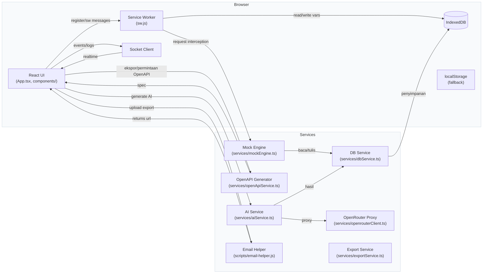

# Arsitektur Backend Studio

## Ringkasan singkat

Backend Studio adalah aplikasi single-page (React + Vite + TypeScript) yang mensimulasikan lingkungan backend sepenuhnya di dalam peramban. Arsitektur utamanya terdiri dari: (1) antarmuka pengguna (UI) React yang mengelola desain & simulasi endpoint, (2) Service Worker yang meng-intercept permintaan jaringan dan meneruskannya ke mesin mock lokal, (3) lapisan _services_ yang mengeksekusi logika simulasi, penyimpanan data (IndexedDB / fallback localStorage), integrasi AI untuk pembuatan skema/data, serta utilitas ekspor (OpenAPI, zip, email). Desain ini memungkinkan pengembangan API tanpa server eksternal—data hanya keluar dari tab bila pengguna memilih tindakan ekspor/unggah.

## Frontend (UI)

UI dibuat dengan React + Vite. Entrypoint (index.tsx) mendaftarkan Service Worker dan merender `App.tsx` yang mengorkestrasi state global minimal, routing internal (views), dan modal (Export, MockEditor, dll.). Komponen utama:

-   Sidebar, Dashboard, MockEditor, TestConsole, ExportModal, LandingPage (lokasi: `components/`).
-   Tipe dan kontrak data didefinisikan di `types.ts` untuk menjaga konsistensi antar komponen dan services.
-   Styling menggunakan Tailwind (saat pengembangan via CDN; untuk produksi disarankan PostCSS/CLI).

## Service Worker (SW)

SW berperan sebagai _interceptor_ jaringan:

-   Mendaftarkan pembajakan (interception) request (mis. `fetch('/api/...')`) dan mengirim pesan ke client.
-   Bila ada mock yang cocok, SW mereturn response yang dihasilkan oleh mock engine; bila tidak, ia dapat meneruskan request ke jaringan asli.
-   SW berkomunikasi dua-arah dengan UI untuk fungsi seperti simulasi trafik, statistik, dan sinkronisasi log.

## Mesin Mock & Routing Permintaan

Komponen inti simulasi berada di `services/mockEngine.ts`:

-   Melakukan pencocokan pola path/route, metode HTTP, dan aturan konflik pattern.
-   Menjalankan template/respon (meliputi variable substitution dan fungsi generator).
-   Menyediakan fitur scenario/flow dan simulasi latency/status codes.
-   Berinteraksi dengan storage untuk menyimpan state endpoint dan data (CRUD simulated data).

## Penyimpanan Data & Migrasi

Penyimpanan memakai IndexedDB (via `services/indexedDbService.ts`) sebagai sumber kebenaran; ada migrasi dari localStorage untuk kompatibilitas sebelumnya.

-   `services/dbService.ts` adalah lapisan abstraksi (alias tersedia untuk kompatibilitas).
-   Data proyek, mock, dan variabel lingkungan disimpan dan dapat diimpor/ekspor (ZIP/JSON).

## Integrasi AI (pembuatan endpoint / data tiruan)

AI dipakai sebagai opsi untuk menghasilkan skema endpoint atau data tiruan (`services/aiService.ts` + `services/openrouterClient.ts` sebagai proxy).

-   Alur: UI → aiService → openrouterClient (proxy) → penyajian hasil → validasi dan normalisasi → tulis ke DB.
-   Validasi ketat menolak shape respon AI yang tidak sesuai (ditambah pembenahan otomatis seperti stringifikasi array/object bila perlu).
-   Fitur ini bersifat optional dan bergantung pada konfigurasi/feature flags.

## OpenAPI & Ekspor

-   `services/openApiService.ts` menghasilkan spesifikasi OpenAPI dari project & endpoint.
-   `services/exportService.ts` & `components/ExportModal.tsx` menangani pembuatan paket ekspor (OpenAPI + workspace) dan interaksi pengiriman.
-   Untuk pengiriman file/email secara demo, ada helper server lokal (`scripts/email-helper.js`) yang menerima upload dan menyediakan URL sementara (dapat di-set untuk upload publik ke 0x0.st).

## Uploads & Email Helper

-   `scripts/email-helper.js` adalah server Express kecil yang menerima file, membatasi tipe/ukuran, menerapkan rate-limit, menyimpan metadata, dan (opsional) mendorong ke layanan publik.
-   UI mengunggah ZIP/JSON yang dihasilkan oleh fitur ekspor ke helper ini saat pengguna memilih mengirim via email.

## Real-time & Observability

-   `services/socketClient.ts` menyediakan koneksi WebSocket/Socket.IO untuk stream log real-time (join rooms, emit logs).
-   Toasts, console debug, dan log SW + server-proxy debug mempermudah diagnosis saat terjadi error (mis. AI response mismatch, proxy error).

## Keamanan & Privasi

-   Default: semua simulasi berjalan di dalam peramban; data tidak meninggalkan tab kecuali pengguna memilih ekspor/unggah.
-   Email helper menerapkan whitelist ekstensi, batasan ukuran, sanitasi nama file, dan rate limiting untuk mengurangi dampak penyalahgunaan.

## Alur Data Ringkas (naratif)

Pengguna membuat atau mengedit mock di UI → data disimpan di IndexedDB melalui dbService → saat klien melakukan request ke endpoint yang disimulasikan, Service Worker menangkapnya → SW meminta Mock Engine untuk menghasilkan response → Mock Engine membaca konfigurasi dari DB, menerapkan template/variable, dan mengembalikan response ke SW → SW mengembalikan response ke aplikasi. Untuk fitur eksport, UI meminta OpenAPI/ZIP → `exportService` membuat artefak → artefak dapat diunduh langsung atau diunggah ke `email-helper` untuk dibagikan.

---

## Diagram (Mermaid)

/_ Diagram menggambarkan komponen utama dan aliran data _/

---

Dokumen ini dimaksudkan sebagai referensi arsitektural singkat dan praktis untuk fitur penilaian/penjelasan teknis. Jika diperlukan, saya dapat menambahkan diagram sequence yang lebih detail untuk skenario spesifik (mis. alur ekspor, alur AI generate, atau alur Service Worker interception).
